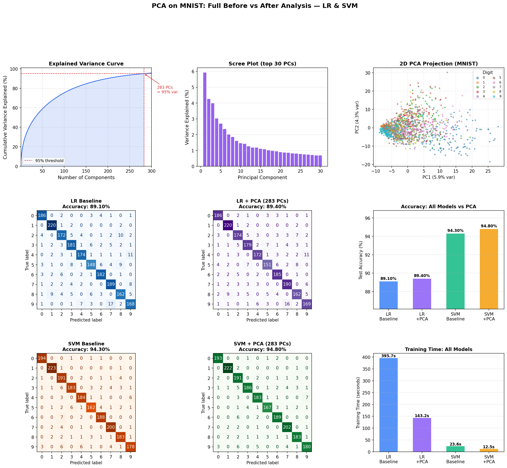

# PCA with Logistic Regression and SVM on MNIST

This project analyzes how Principal Component Analysis (PCA) affects MNIST digit classification using two models:

- Logistic Regression
- Support Vector Machine (RBF kernel)

The main notebook is [PCA_LR_SVM.ipynb](PCA_LR_SVM.ipynb). It loads MNIST, standardizes the data, trains baseline models, selects the number of principal components from explained variance, retrains both models with PCA, and saves comparison plots.

## Setup used in the notebook

- Dataset: MNIST (`70,000` images, `28x28` pixels)
- Working subset for the saved run: `10,000` samples
- Train/test split: `8,000 / 2,000`
- PCA choice: `283` components to retain `95%` explained variance

## Results from the saved notebook run

| Model | Features | Train Time | Memory | Test Accuracy |
|---|---:|---:|---:|---:|
| Logistic Regression | 784 | 395.65s | 0.04 MB | 89.10% |
| Logistic Regression + PCA | 283 | 143.20s | 0.02 MB | 89.40% |
| SVM (RBF) | 784 | 23.65s | 23.40 MB | 94.30% |
| SVM (RBF) + PCA | 283 | 12.46s | 7.89 MB | 94.80% |

## Takeaways

- PCA reduced the feature space by about `64%` (`784 -> 283`).
- Logistic Regression became about `2.8x` faster and gained `+0.30%` accuracy.
- SVM became about `1.9x` faster and gained `+0.50%` accuracy.
- In this run, `SVM + PCA` produced the best overall performance.

## Generated artifacts

- [pca_mnist_analysis.png](pca_mnist_analysis.png): variance curve, 2D PCA projection, confusion matrices, accuracy and time comparison
- [eigendigits.png](eigendigits.png): first principal components visualized as eigendigits
- [pca_reconstruction.png](pca_reconstruction.png): reconstruction quality at different numbers of components

